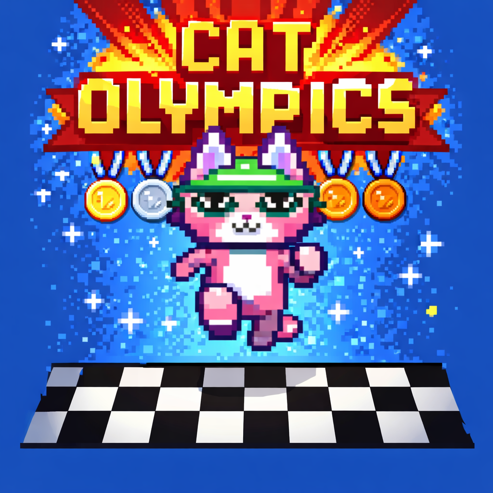

# Cat Olympics

## Overview
**Cat Olympics** is a simple 2D runner game created for the One Hour Game Jam.  
The player controls a cat moving down a lane while avoiding banana peels.  

The game emphasizes procedural content generation (PCG) and simple, responsive controls for a fun, fast-paced experience.

---

## How to Play
- **Start the game:** Press **SPACE** to start running.  
- **Move left/right:** Use **A** and **D** keys.  
- **Objective:** Reach the finish line while avoiding banana peels.  
- **Banana peels:** Colliding with a peel slows the player for **3 second**, then speed gradually returns to normal.  
- **Finish line:** The player stops smoothly at the end of the lane.

---

## Features
- **Procedurally generated obstacles:** Banana peels are spawned using a Gaussian-based random pattern along the lane, ensuring variation in each playthrough.  
- **Smooth movement and animation:** The runner has three animations: run straight, turn left, and turn right.  
- **Slip effect:** Banana peels trigger a smooth speed reduction and recovery.  
- **Camera:** The camera follows the runner vertically while keeping horizontal movement centered.
- **Timer UI:** Displays elapsed time in the corner during the run.
- **Sound effects:**
--  Running footsteps (looping)
--  Slip sound when hitting a banana peel
--  Victory fanfare when reaching the finish line

---

## How It Was Made
- **Engine:** Godot 4.4.1  
- **Language:** GDScript  
- **Graphics:** 2D pixel art for the runner and obstacles  
- **Tilemap:** The lane is built using a 32×32 pixel tilemap.  
- **Player movement:** Horizontal movement controlled via `Input.get_axis("ui_left", "ui_right")`. Vertical movement is constant, and starts when pressing SPACE.  
- **Procedural Generation:** Bananas are instanced at runtime along the lane using a Gaussian distribution, limited to one per horizontal row.  
- **Collision & Effects:** Bananas use `Area2D` with `CollisionShape2D` to detect the player and trigger the slip effect.  
- **Animations:** AnimatedSprite2D switches animations based on player movement direction and slip status.
- **Audio:** AudioStreamPlayer nodes for running loop, slip, and win sounds
- **UI:** CanvasLayer with Label for real-time timer display

---

## Resources

https://pixabay.com/sound-effects/cartoon-yoink-1-183915/

https://pixabay.com/sound-effects/you-win-sequence-1-183948/

https://pixabay.com/sound-effects/running-on-concrete-268478/

https://pipoya.itch.io/pipoya-free-rpg-character-sprites-nekonin

